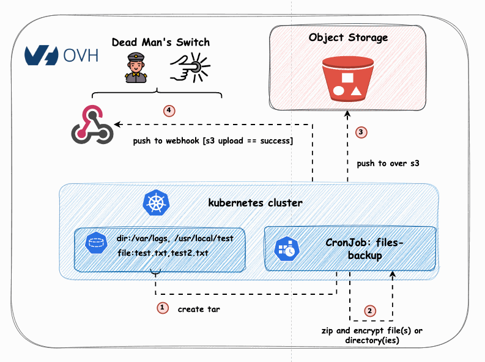

## README: File and Directory Backup to S3 with Encryption

This README outlines the usage of the provided Dockerfile and shell script for backing up files and directories to any S3-compatible object storage, incorporating encryption and optional webhook notifications for successful uploads. It also includes Kubernetes deployment and a Helm chart for automated scheduling.



This tool is designed to offer a flexible solution for:

1. Backing up specified files or directories or both.
2. Encrypting and compressing backup data client-side.
3. Uploading encrypted backups to S3-compatible object storage with support for WriteOnceReadMany (WORM) and customizable retention policies.
4. Optionally triggering a webhook notification for each successful backup upload.

## Getting Started

Before utilizing this tool, ensure you have:

- A list of file paths and directories to back up.
- S3 Bucket details for storage.
- (Optional) A webhook endpoint for notifications.
- An encryption key for securing your backups.

## Key Components

The Dockerfile assembles an environment with the necessary utilities for performing backups, file encryption, and sending webhook notifications. The script automates the process to:

1. Compress and encrypt specified files and directories.
2. Upload the secured backups to S3-compatible storage.
3. (Optional) Notify a webhook about the upload.

## Prerequisites

- Docker for building and running the container.
- An S3-compatible object storage bucket.
- (Optional) A server or Kubernetes cluster for deploying the CronJob.
- (Optional) A configured webhook endpoint for receiving notifications.

## Configuration

Store sensitive information such as S3 credentials and the encryption key securely. In Kubernetes, use secrets for these values at runtime.

### Environment Variables

Configure the following environment variables according to your setup:

- `AWS_S3_ENDPOINT_URL`: Your object storage endpoint URL.
- `AWS_S3_ACCESS_KEY_ID` and `AWS_S3_SECRET_ACCESS_KEY`: Access credentials for the S3 bucket.
- `AWS_S3_BUCKET`: The bucket name for storing your backups.
- `ENCRYPTION_KEY`: Your chosen key for encryption.
- `FILE_PATH`, `DIRECTORY_PATH`: Paths for the files or directories you intend to back up.
- `WEBHOOK_ENDPOINT`: (Optional) Your webhook URL for notifications.

## Usage Instructions

1. **Build the Docker Image:**

   ```bash
   docker build -t ghcr.io/la-cc/k8s-data-to-s3-cronjob:0.0.0 .
   ```

2. **Run Locally for Testing:**

   ```bash
   docker run --env-file .env ghcr.io/la-cc/k8s-data-to-s3-cronjob:0.0.0
   ```

   Ensure `.env` contains all necessary environment variables.

3. **Deploy on Kubernetes:**

   For Kubernetes, set up a `CronJob` with related `Secret` and `ConfigMap` resources to manage scheduling and environment variables.

4. **Helm Chart Deployment:**

   Use the included Helm chart for an easier Kubernetes deployment. Adjust the chart values to match your environment variables and backup schedule.

## Security Measures

The setup uses a non-root user (`backupuser`) for operations, enhancing security. Ensure your Kubernetes deployment respects this configuration.

## Conclusion

This tool provides a secure and automated solution for backing up your data to S3-compatible storage, with the added benefit of encryption and optional webhook notifications. Tailor the configuration to suit your specific requirements.
